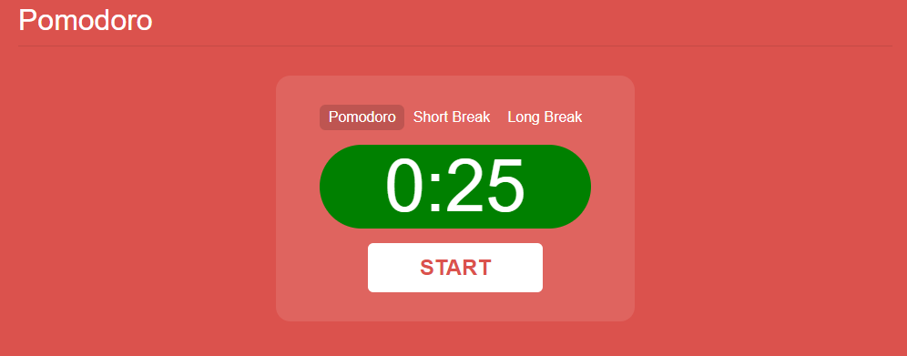
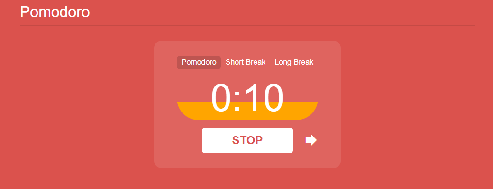
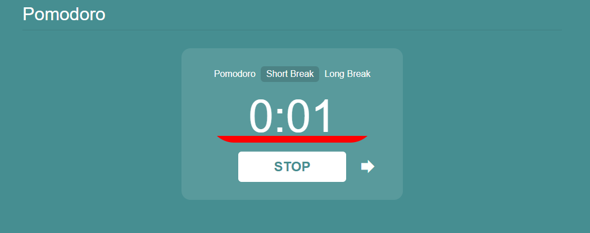
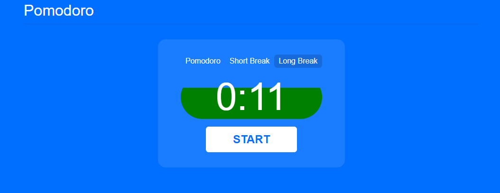

  <h1 align="center">Pomodoro Timer</h1>

An online pomodoro timer in the browser. 

The Pomodoro technique was invented in order to improve productivity. The technique traditionally involves 25 minute work sessions called pomodoros separated by short breaks, and a long break after a couple of these cycles. 

The webpage is responsive for various screen sizes and changes colors according to the mode you are in.

## 📝 Table of Contents

- [📝 Table of Contents](#-table-of-contents)
- [🖼️ Project Images ](#-project-images-)
- [🚀 Future Scope ](#-future-scope-)
- [🏁 Getting Started ](#-getting-started-)
  - [Running the project ](#running-the-project-)
- [⛏️ Built With ](#️-built-with-)
- [✍️ Author ](#️-author-)

## 🖼️ Project Images 

  

See More Images

 

  
  
  

## 🚀 Future Scope 

I may decide to add some of the following features in the future:
- 📝 Todo list
- ⏱️ Variable time functionality
- 🎨 Alternative color schemes
- ℹ️ Pomodoro timer info

## 🏁 Getting Started 

These instructions will get you a copy of the project up and running on your local machine for development and testing purposes.

### Running the project 

To view the project locally:

1. Clone the repository
2. Open index.html by clicking on the file in your file viewer (it should open in the browser)

## ⛏️ Built With 

- [HTML](https://developer.mozilla.org/en-US/docs/Web/HTML) - Markup language
- [CSS](https://developer.mozilla.org/en-US/docs/Web/CSS) - Styling HTML
- [JavaScript](https://developer.mozilla.org/en-US/docs/Web/JavaScript) - Programming language

## ✍️ Author 

- [JakubRichardson](https://github.com/JakubRichardson) 